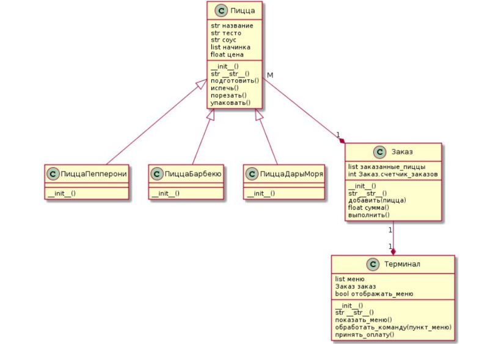

#Пиццерия#

Пиццерия предлагает клиентам три вида пиццы: Пепперони, Барбекю и Дары Моря, уаждая из которых определяется тестом, соусом и начинкой.
Требуется спроектировать и реализовать приложение для терминала, позволяющее обеспечить обслуживание посетителей.
*Дополнительная информация*
В бизнес-процессе работы пиццерии в контексте задачи можно выделить 3 сущности (объекта)
-Терминал: отвечает за взаимодействие с пользователем:
 вывод меню на экран
 прием команд от пользователя (выбор пиццы, подтверждение заказа, оплата и др.)
- Заказ: содержит список заказанных пицц, умеет подсчитывать свою стоимость
- Пицца: содержит заявленные характеристики пиццы, а также умеет себя подготовить(замесить тесто, 
собрать ингедиенты и т.д.), испечь, порезать и упаковать
Так как пиццерия реализует несколько видов пиццы, которые различаются характеристиками, логично будет сделать общий класс Пицца, а в дочерних класса(Например, класс
ПиццаБарбекю) уточнить характеристики конкретной пиццы.

Алгоритм работы пользователя с терминалом может выглядеть следующим образом:
1. Теримнал отображает список меню.
2. Терминал создаёт новый заказ.
3. Клиент вводит номер пиццы из меню.
4. Заказ добавляет в список выбранную пиццу.
5. Действия 3-4 повторяются до подтверждения или отмены.
6. Клиент подтверждает заказ (или отменяет)
7. Терминал выставляет счет, отображая информацию о заказе.
8. Терминал принимает оплату.
9. Заказ отдается на выполнение.

